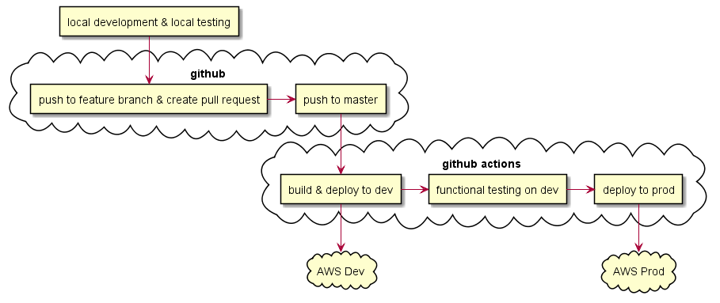
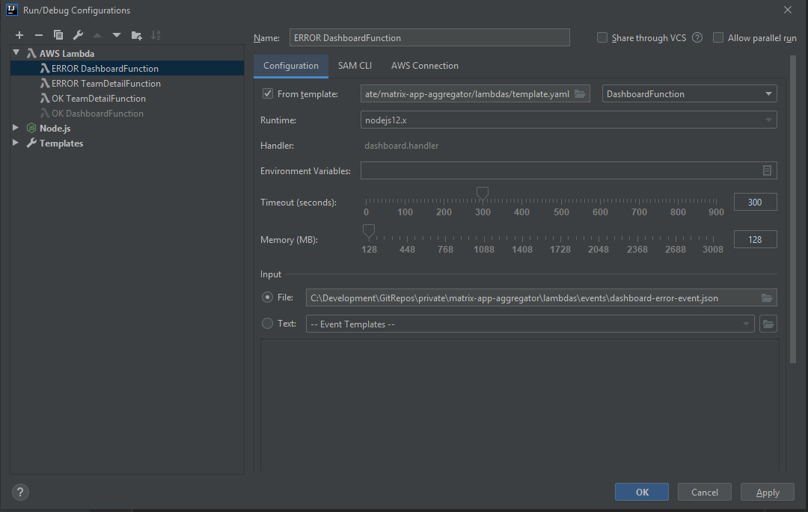
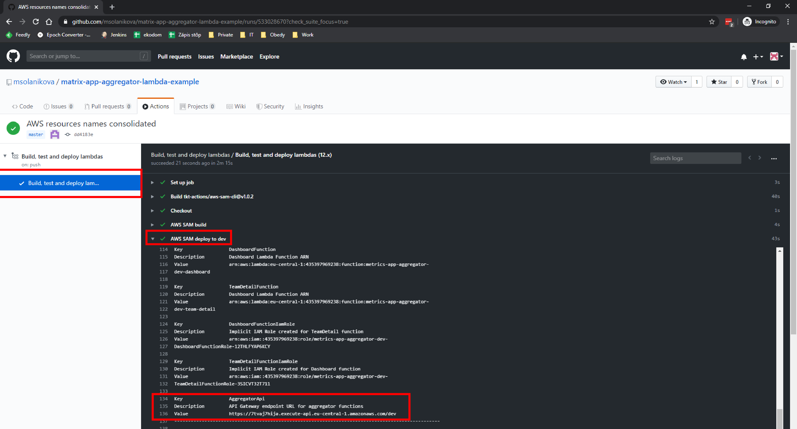

# Development Process

## Outline
- [Local Development](#local-development)
    - [Tools for local development](#tools-for-local-development)
    - [Example project](#example-project)
    - [Invoking and debugging Lambda function locally](#invoking-and-debugging-lambda-function-locally)
    - [Publishing common library (module)](#publishing-common-library-module)
    - [Using common library locally](#using-common-library-locally)
    - [What needs to be configured for new project](#what-needs-to-be-configured-for-new-project)
- [DEV and PROD Environments](#dev-and-prod-environments)
    - [How infrastructure can be managed](#how-infrastructure-can-be-managed)
    - [DynamoDB tables per environment](#dynamodb-tables-per-environment)
- [Continuous integration and deployment pipeline using Github Actions](#continuous-integration-and-deployment-pipeline-using-github-actions)
  - [1. Fully automated workflow](#1-fully-automated-workflow)
  - [2. Manual prod deploy on demand (on approval)](#2-manual-prod-deploy-on-demand-on-approval)
  - [3. Manual prod deploy on release tag creation (the best?)](#3-manual-prod-deploy-on-release-tag-creation-the-best)

Development process overview


For this project, at least dev and prod environments are needed to be able to reliably test changes before they are rolled out to user. At least for now it's not necessary to have staging environment.

## Local Development

### Tools for local development
- install [Docker](https://www.docker.com/products/docker-desktop) and start it
- install [AWS CLI](https://aws.amazon.com/cli/)
    - aws configure
    - use credentials from Files section in Teams -> Metric App Kosice -> General
    - use eu-central-1 region
    - use json as default output format
- install [AWS SAM](https://aws.amazon.com/serverless/sam/)

### Example project
https://github.com/msolanikova/matrix-app-aggregator-lambda-example

Important files to notice:
- [`template.yaml`](https://github.com/msolanikova/matrix-app-aggregator-lambda-example/blob/master/template.yaml) - AWS SAM configuration file where all aws resources are defined
    - ApiGatewayApi - API Gateway with single stage specified via parameter
    - DashboardFunction - lambda function with /teams-stats endpoint in API Gateway
    - TeamDetailFunction - lambda function with /team-detail endpoint in API Gateway
- [`samconfig.toml`](https://github.com/msolanikova/matrix-app-aggregator-lambda-example/blob/master/samconfig.toml) - default values of parameters, like stack name, region, etc. 
    - default value of stack name should be [github repository name]-dev, e.g. metrics-app-aggregator-dev
    - for prod deploy, stack name is overriden (by providing parameter) to [github repository name]-prod, e.g. metrics-app-aggregator-prod
- [`.github/workflows/main.yml`](https://github.com/msolanikova/matrix-app-aggregator-lambda-example/blob/master/.github/workflows/main.yml) - github actions workflow for deployment to dev, testing and deployment to prod
    - this github action workflow is triggered by pushing to master branch, so whenever pull request is merged to master, this workflow is started
    - after successful execution, comment about success is added to commit that triggered this workflow
    - after failed execution, comment about failure is added to commit that triggered this workflow. It's possible to configure github notifications to be notified when workflow fails
- [`.github/workflows/prod-deploy-on-request.yml`](https://github.com/msolanikova/matrix-app-aggregator-lambda-example/blob/master/.github/workflows/prod-deploy-on-request.yml) - github actions workflow for production deployment on demand
    - useful when production deploy MUST be triggered on demand, e.g. when other parts of applications are read
    - can be triggered by `POST https://api.github.com/repos/msolanikova/matrix-app-aggregator-lambda-example/dispatches` with following headers and body:
        - Accept: application/vnd.github.everest-preview+json
        - Authorization: token [personal github token]
        - body: `{ "event_type": "prod-deploy" }`
- lambda functions - each lambda function has its own folder with its own `package.json` file, e.g.
    - [`metrics-dashboard`](https://github.com/msolanikova/matrix-app-aggregator-lambda-example/tree/master/metrics-dashboard)
    - [`metrics-team-detail`](https://github.com/msolanikova/matrix-app-aggregator-lambda-example/tree/master/metrics-team-detail)
- `events` folder contains testing event object for local executions of  lambda functions
- `functional-tests` - folder containing functional tests that can be executed agains dev environment

### Invoking and debugging Lambda function locally
- before lambda functions can be invoked locally, docker needs to be running
- [with Visual Studio Code](https://docs.aws.amazon.com/serverless-application-model/latest/developerguide/serverless-sam-cli-using-debugging-nodejs.html)
- with Intellij Idea
    - install [AWS Toolkit plugin](https://plugins.jetbrains.com/plugin/11349-aws-toolkit)
    - create Run/Debug Configuration of type AWS Lambda (provide path to template file and input file representing event object)
    
    
### Publishing common library (module)
Common functionality can be encapsulated into new separate module that can be published to a registry and used anywhere in Metrics App project.

Example of common module (library) is in [`metrics-common-lib`](https://github.com/msolanikova/matrix-app-aggregator-lambda-example/tree/master/metrics-common-lib) folder. In order to use this module in other projects without the need to copy it to other projects (to other lambda functions that are then deployed to AWS), it needs to be published to some package registry. For node.js there are couple of options:
- to use a public registry https://registry.npmjs.org/ (similar to maven central in java). All published modules (libraries) are then public
- to use [Github Packages](https://help.github.com/en/packages) public registry. It's still public and published modules can be used anywhere in github. It's not possible to delete such packages (or their versions)
- to use [Github Packages](https://help.github.com/en/packages) private registry (associated with private repository). Modules here can be shared within organisation or with collaborators. Each github account has by default 500MB of storage (1GB data transfer per month) for free. More info about Github Packages billing [here](https://help.github.com/en/github/setting-up-and-managing-billing-and-payments-on-github/about-billing-for-github-packages). 

This example of common module was **published to public github registry** (second option) as all Metrics App repositories are currently public. 

Publishing can be automated using Github Actions, but for now it will be a manual process. Repository owner (or collaborator with github token able to publish) has to go through following steps:
* `package.json` of given common module should contain `publishConfig` property containing registry url. This can also be configured in `.npmrc` (local npm config file), but using `package.json` clearly states for **everyone** where this module is pulished
```json
"publishConfig": {
  "registry": "https://npm.pkg.github.com"
}
```
* configure your local `.npmrc` file with registry and github token with publishing permissions. Either copy/paste example `.npmrc` and modify username or follow these steps:
  * `npm login --registry=https://npm.pkg.github.com`. (If proper `.npmrc` file already exists, login is no longer necessary.) On prompt enter:
    * your github username
    * github token with write:package permissions as password 
    * public email
  * add registry to `.npmrc` by running `npm config set registry https://npm.pkg.github.com/msolanikova` (replace `msolanikova` with your account where package should be published)
  * see more info about [Configuring npm for use with GitHub Packages here](https://help.github.com/en/packages/using-github-packages-with-your-projects-ecosystem/configuring-npm-for-use-with-github-packages)
  * `.npmrc` file should look similar to this (with some real token with write package permissions). Replace `msolanikova` with account name where package should be published
  ```
  //npm.pkg.github.com/:_authToken=realtokenwithWRITE_PACKAGEpermissions
  registry=https://npm.pkg.github.com/msolanikova
  ```
  * in case there are multiple accounts where modules are published, `.npmrc` file could look like following:
  ```json
  //npm.pkg.github.com/:_authToken=realtokenwithWRITE_PACKAGEpermissions
  registry=https://npm.pkg.github.com/msolanikova
  @msolanikova:registry=https://npm.pkg.github.com
  @otheraccount:registry=https://npm.pkg.github.com
  ```
* install your module locally by `npm install`
* publish module by `npm publish`

### Using common library locally
Once common library is published to a registry, it can be used in other projects. On any machine where common module should be used and installed via `npm install`, proper `.npmrc` file must exist 
* create `.npmrc` file similar to ones in previous chapter
* dependency of common module should contain scope: `@account/packagename`
  * e.g. `"@msolanikova/matrix-app-aggregator-common-lib": "1.0.2"` 
* run `npm install`
* more info about [installing a package can be found here](https://help.github.com/en/packages/using-github-packages-with-your-projects-ecosystem/configuring-npm-for-use-with-github-packages)

### What needs to be configured for new project
- `template.yaml` - AWS SAM configuration
- `samconfig.toml` - AWS SAM default values, watch out for cloudformation stack name to be unique
- `.github/workflows/main.yml` - github actions CI/CD pipeline
- Secrets in github repository - repo owner must create following secrets:
    - `AWS_ACCESS_KEY_ID` and `AWS_SECRET_ACCESS_KEY` for account that has permissions for lambdas deploy
    - `token` - github personal token for github actions to be able to comment on commits

## DEV and PROD Environments
AWS services like API Gateway or AWS Lambdas offer various ways how to handle dev and production environments (e.g. stages in API Gateway or aliases in AWS Lambdas). However, in order to clearly separate the environments and not have production services coupled with dev services, it might be better to create separate resources for each environment (different API Gateway for dev and prod). See ['Single stack vs multi stack' section here](https://medium.com/@sgarcez/managing-multi-environment-serverless-architecture-using-aws-an-investigation-6cd6501d261e)

### How infrastructure can be managed
In AWS, [CloudFormation](https://aws.amazon.com/cloudformation/) is an infrastructure management tool which operates over 'stack' encapsulating multiple resources. In combination with AWS CLI and AWS SAM CLI, it's possible to easily set up CI/CD pipelines from github to production. It's not necessary to know CloudFormation in details as AWS SAM CLI prepares whole stack with very simple specification. CloudFormation stack encapsulates all defined resources, so if stack is removed, all resources are removed as well. If update of some resource fails, stack is rolled back. AWS SAM CLI can check the state of given stack to see if any changes are necessary. 

Suggested github repositories:
- aggregator with following lambda functions (and their related API Gateways)
    - dashboard
    - team detail with jira metrics
    - team detail with github metrics
- jira backend with lambda functions
    - jira backend REST API
    - jira collector for e.g. issues
    - jira collector for e.g. worklogs
- github backend with lambda functions
    - github backend REST API
    - github collector for e.g. number of commits
    - github collector for other statistics

Each github repository represents one dev and one production 'stack', so all lambdas, api gateways and other defined AWS resources of given github repository will be deployed within these two ClouFormation stacks. So there will be following cloudformation stacks:

| CloudFormation Stack        | Lambda Functions                                                                                                         | API Gateways                                                       |
|-----------------------------|--------------------------------------------------------------------------------------------------------------------------|--------------------------------------------------------------------|
| metrics-app-aggregator-dev  | metrics-app-aggregator-dev-dashboard<br>metrics-app-aggregator-dev-team-detail<br>                                       | ApiGatewayApi with stage dev<br>- /dashboard<br>- /team-detail     |
| metrics-app-aggregator-prod | metrics-app-aggregator-prod-dashboard<br>metrics-app-aggregator-prod-team-detail<br>                                     | ApiGatewayApi with stage prod<br>- /dashboard<br>- /team-detail    |
| metrics-app-jira-dev        | metrics-app-jira-dev-backend<br>metrics-app-jira-dev-issues-collector<br>metrics-app-jira-dev-worklogs-collector         | ApiGatewayApi with stage dev<br>- /velocity<br>- /estimations      |
| metrics-app-jira-prod       | metrics-app-jira-prod-backend<br>metrics-app-jira-prod-issues-collector<br>metrics-app-jira-prod-worklogs-collector      | ApiGatewayApi with stage prod<br>- /velocity<br>- /estimations     |
| metrics-app-github-dev      | metrics-app-github-dev-backend<br>metrics-app-github-dev-commits-collector<br>metrics-app-github-dev-impact-collector    | ApiGatewayApi with stage dev<br>- /user-commits<br>- /user-impact  |
| metrics-app-github-prod     | metrics-app-github-prod-backend<br>metrics-app-github-prod-commits-collector<br>metrics-app-github-prod-impact-collector | ApiGatewayApi with stage prod<br>- /user-commits<br>- /user-impact |

Each github repository should contain `template.yaml` file containing definitions of AWS resources defined within given stack. This file is then used by AWS SAM CLI tool and it creates CloudFormation stack and all defined resources. Repository should also contain `samconfig.toml` file containing default (dev related) values, like stack name, default API Gateway stage, etc. 

With this configuration, deploy to dev can happen with following command (will be executed in github actions, not locally):
```bash
sam build && sam deploy
```
Production deploy:
```bash
sam deploy --stack-name {insert stack name here}-prod
```
AWS SAM CLI automatically recognized which AWS resources need to be changes. 

### DynamoDB tables per environment

DynamoDB doesn't support separate environments or separate clusters, so the separation is usually done by table prefix. So all tables should be created with `dev-` or `prod-` prefix based on environment they should be used in. 

Environment (or stage) is passed to AWS Lambda functions as environment variable, see [here](https://github.com/msolanikova/matrix-app-aggregator-lambda-example/blob/master/template.yaml#L110). In Lambda function, environment variable is accessed via `process.env`, see [here](https://github.com/msolanikova/matrix-app-aggregator-lambda-example/blob/master/metrics-dynamodb/dynamodb-write.js#L19)

## Continuous integration and deployment pipeline using Github Actions
Github Actions provide powerful way how to implement full CI/CD solution without the need to have a dedicated build server like jenkins. 

Github Actions are driven by workflows stored in `.github/workflows` folder in each github repository. 

Check all runs in example repo [here](https://github.com/msolanikova/matrix-app-aggregator-lambda-example/actions). Repository collaborators can check details of each run and their outputs. **Output of 'AWS SAM deploy to {env}' step contains URL of created API Gateway** via which all http triggered lambdas of given github repository are accessible. 


Suggested workflows:

### 1. Fully automated workflow
- everything in single github actions workflow
- dev deploy after push to master -> functional tests -> prod deploy if tests were successful
- see example [here](https://github.com/msolanikova/matrix-app-aggregator-lambda-example/blob/master/.github/workflows/main.yml)

### 2. Manual prod deploy on demand (on approval)
- dev deploy after push to master -> functional tests
- prod deploy on demand (after 'approval')
- see example of prod deploy on demand [here](https://github.com/msolanikova/matrix-app-aggregator-lambda-example/blob/master/.github/workflows/prod-deploy-on-http-request.yml)
  - can be triggered by `POST https://api.github.com/repos/:owner/:repo/dispatches` with following headers and body:
    - Accept: application/vnd.github.everest-preview+json
    - Authorization: token [personal github token]
    - body: `{ "event_type": "prod-deploy" }` or other event type based on `github.event.action` check in workflow

### 3. Manual prod deploy on release tag creation (the best?)
- dev deploy after push to master -> functional tests
- prod deploy when tag starting with 'release' is created
- release information is included also in CloudFormation stack, so it's clear which tag is currently deployed
- rollback can happen by deploying previous 'release' tag
  - can be triggered by `POST https://api.github.com/repos/:owner/:repo/dispatches` with following headers and body:
    - Accept: application/vnd.github.everest-preview+json
    - Authorization: token [personal github token]
    - body: `{ "event_type": "prod-tag-deploy", "client_payload": {"tag": "release-1.0.12"} }` or other event type based on `github.event.action` check in workflow
- see example of prod deploy on tag creatinon [here](https://github.com/msolanikova/matrix-app-aggregator-lambda-example/blob/master/.github/workflows/prod-deploy-on-tag.yml)
- see example of rollback via http request [here](https://github.com/msolanikova/matrix-app-aggregator-lambda-example/blob/master/.github/workflows/prod-rollback-on-http-request.yml)
